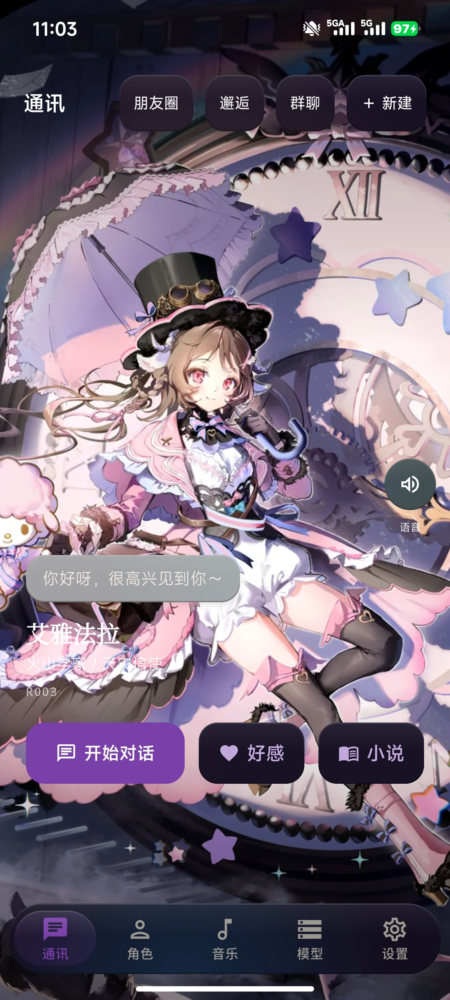
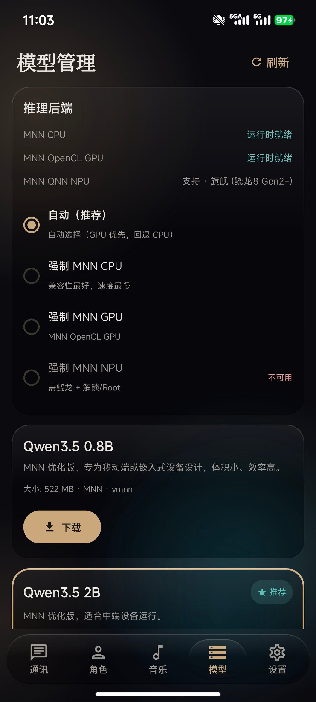
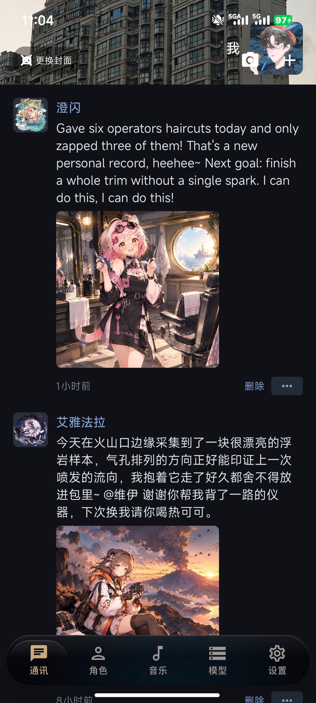
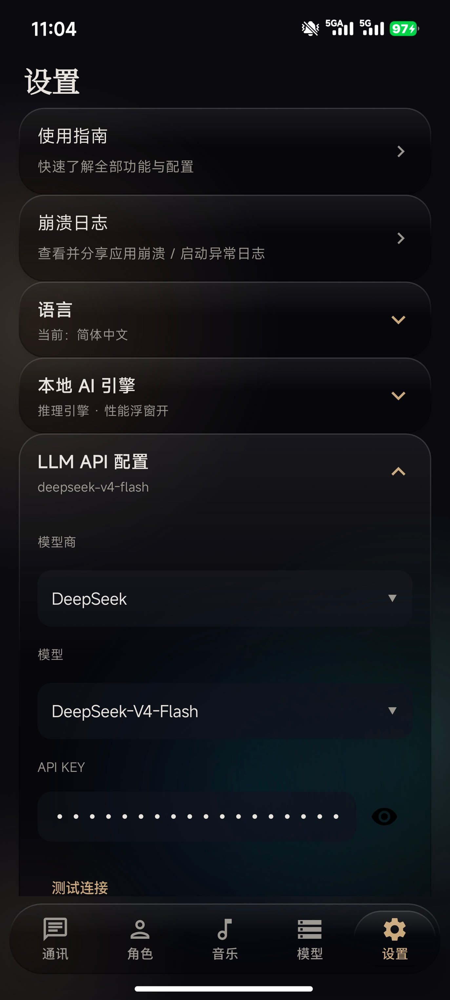
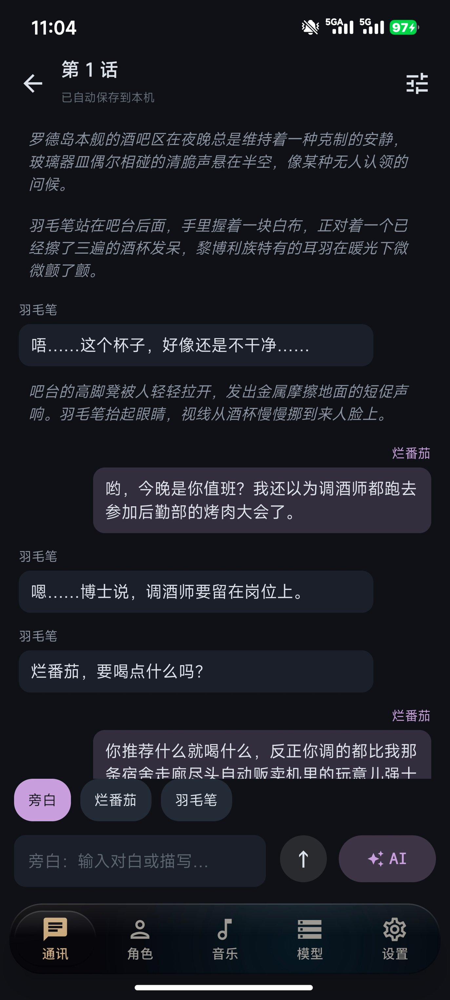
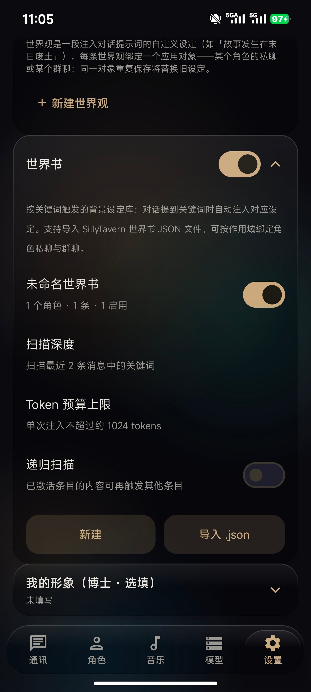
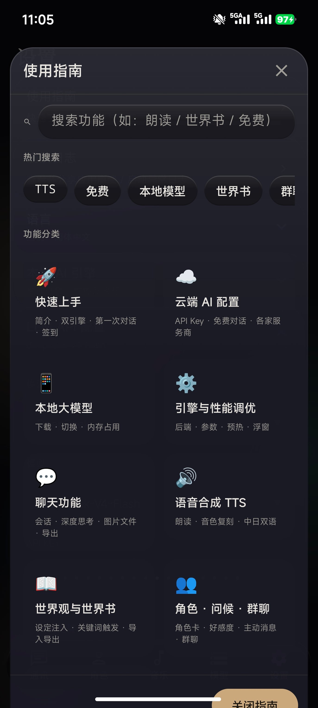
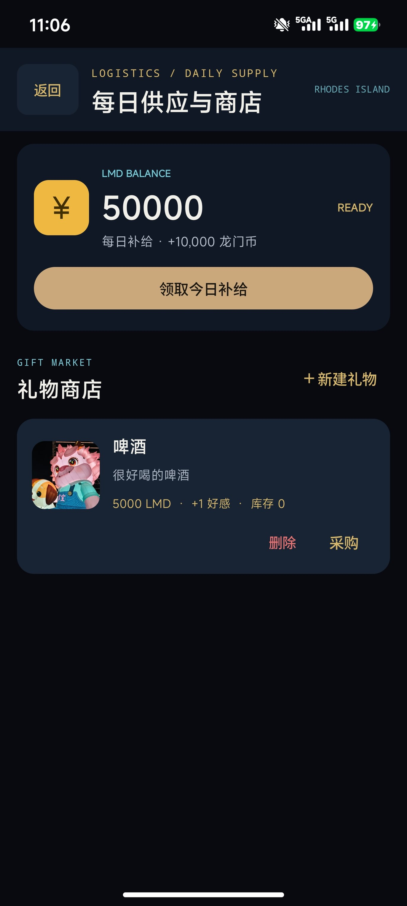
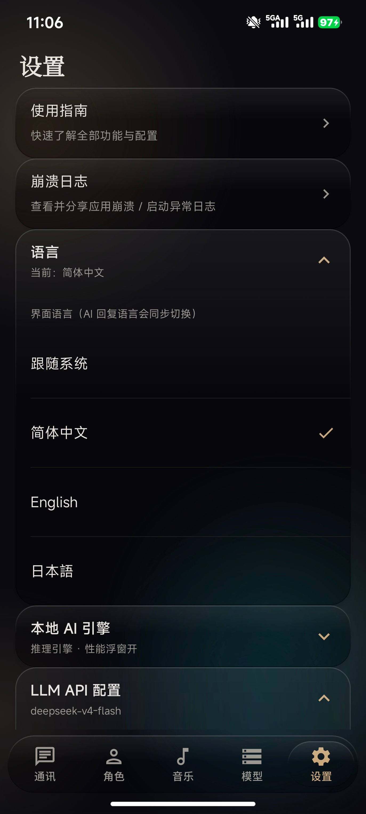

# Rhodes Island Terminal

[简体中文](README.md) ｜ [English](README_EN.md) ｜ **日本語**

> アークナイツの二次創作 AI ロールプレイチャットアプリ：オンデバイスの **MNN ローカル LLM 推論**（CPU / GPU / NPU 適応＋深い思考）とクラウドのデュアルエンジン、さらにアークナイツの BGM / ボイス / 立ち絵を内蔵。ローカルの会話データはすべて端末内に保存され、完全オフラインでも動作します。

[](https://kotlinlang.org)
[](https://developer.android.com/compose)
[](https://github.com/alibaba/MNN)
[](LICENSE)

---

## 🖼️ 機能ツアー

| | | |
|:---:|:---:|:---:|
| <br>**① フィード · キャラクターカード**<br><sub>全画面立ち絵をスワイプ、タップで会話開始</sub> | <br>**② ローカル大規模モデル**<br><sub>MNN 3 バックエンド適応、オフライン推論</sub> | <br>**③ モーメンツ**<br><sub>キャラが自動投稿、いいねとコメント</sub> |
| <br>**④ クラウド AI · API 設定**<br><sub>プリセット事業者、キーを入れるだけ</sub> | <br>**⑤ インタラクティブ小説**<br><sub>ナレーション＋台本、AI が一章を執筆</sub> | <br>**⑥ 世界観と世界書**<br><sub>会話へ設定を注入、キーワードで発動</sub> |
| <br>**⑦ アプリ内ガイド**<br><sub>検索できる機能マニュアル</sub> | <br>**⑧ 毎日補給とギフトショップ**<br><sub>ログインで龍門幣、ギフトで好感度</sub> | <br>**⑨ 多言語 UI**<br><sub>中／英／日、AI の返答も追従</sub> |

---

## 📖 機能詳細

### ① フィード · キャラクターカード

- TikTok 風の全画面カードフィード：縦スワイプで **ロドスのオペレーター 384 名**を閲覧（20 名はボイスとローカル立ち絵付き、364 名は自動生成で、ゲーム内スキル／素質を人設に反映）
- カードから直接「**会話を始める／好感度／小説**」へ。上部のグラスバーから「モーメンツ／邂逅／グループチャット／新規作成」へ
- 立ち絵の主要色がボタンとドックのアクセントカラーをリアルタイムに変化させます

### ② ローカル大規模モデル · オンデバイス MNN 推論

- **MNN CPU / OpenCL GPU / QNN NPU** の 3 バックエンドを適応的にスケジューリング（自動推薦／強制指定）。GPU 失敗時は自動で CPU にフォールバックし、完全オフライン・データは端末外に出ません
- モデルマーケット内蔵：**Qwen3.5 など MNN モデル 13 種**、マルチミラー配信（ModelScope → hf-mirror → HuggingFace）、レジューム対応＋SHA-256 整合性チェック
- **ローカル深い思考**の段階（AUTO / SHORT / MEDIUM / LONG）と折りたたみ可能な思考表示。メモリ不足時はコンテキストを段階的に半減し、クラッシュやエラーになりません
- 実験的加速（lookahead／マルチトークンデコード）は実機ベンチマークで効果が証明された場合のみ有効化
- **リキッドグラス性能オーバーレイ**：token/s、CPU / GPU / NPU、温度、メモリをリアルタイム表示

### ③ モーメンツ

- WeChat のモーメンツ風フィード：キャラクターが人設に沿って**自動投稿**（AI 文案＋AI 生成画像）。いいね・コメントができ、コメントにはキャラが返信します
- 自分も画像付きで投稿可能。自動投稿スケジュール（8 時〜23 時）でフィードが賑わいます

### ④ クラウド AI · LLM API 設定

- OpenAI 互換 `/chat/completions` の **SSE ストリーミング直結**。DeepSeek / OpenAI / Qwen / Zhipu などのプリセット事業者を選び、API キーを貼り付けてワンタップで接続テスト
- クラウドとローカルのエンジンはいつでも切り替え可能。会話はキャラクターごとに保存されます
- マルチモーダルモデルなら画像（最大 3 枚）、PDF（先頭 6 ページ）、テキストファイルを直接送信できます

### ⑤ インタラクティブ小説

- 「ナレーション＋キャラクターの台詞」形式の台本：AI が一章分のプロットを一括生成し、話者ごとに色分けした吹き出しで表示
- 章はローカルに自動保存されるので、いつでも続きを執筆できます。複数ストーリー／複数章に対応

### ⑥ 世界観と世界書

- **世界観**：独自の設定（例「物語は終末の荒野で起こる」）をプロンプトに注入。特定キャラクターの個人チャットや特定のグループチャットに紐付け可能
- **世界書**：キーワードで発動する背景設定ライブラリ。**SillyTavern の世界書 JSON** をインポート可能で、走査深度・Token 予算・再帰走査を調整できます

### ⑦ アプリ内ガイド

- アプリ内の検索型マニュアル：人気検索と機能カテゴリ（はじめかた／クラウド AI／ローカルモデル／チャット／TTS／世界観と世界書／キャラクター・挨拶・グループチャット…）
- UI 言語（中国語／英語／日本語）に追従し、キーワードを入力すれば答えが出ます

### ⑧ 毎日補給とギフトショップ

- 毎日ログインで **龍門幣 10,000** を獲得。ギフトショップではオリジナルギフト（価格／好感度ボーナス／在庫）を作成し、購入してキャラクターに贈れます
- **好感度システム**：上限レベル 200、ギフトウォールの振り返り、特別な邂逅イベントのアーカイブ

### ⑨ 多言語 UI · AI の返答も追従

- **システムに追従／简体中文／English／日本語** をワンタップで切り替え
- UI だけでなく、**キャラクターの返答も選択した言語**になります（人設・世界観・世界書は中国語のままでも AI が理解します）

---

## ✨ その他の機能

- **🔊 デュアル TTS** — オフラインのシステム TTS（既定・設定不要）と、Volcengine Doubao のクラウド音声クローン（キャラごとの声、中国語／日本語）。読み上げ前に思考ブロックを除去
- **🎬 邂逅 · キャラクター動画** — Seedance によるショート動画生成（自動トリガー／再生／書き出し／履歴）、参考画像とシーンをカスタマイズ可能
- **💬 グループチャット** — 複数キャラのルーム。@ した相手は必ず返信、メンバー同士のバックグラウンド会話、新着通知つき
- **⏰ キャラクターからの自発的な挨拶** — 15 分周期のスケジューリングと正確なアラームのフォールバックにより、キャラクターから先にメッセージが届きます（再起動後も有効）
- **📝 Markdown レンダリング** — コードハイライトと数式、深い思考ブロックの折りたたみ表示
- **🎵 音楽プレイヤー** — 内蔵アークナイツ BGM と NetEase Cloud の OST カタログ、オンライン検索、ローカル音楽の取り込み、バックグラウンド再生（現在は「設定 → 音楽」内）
- **🎨 PRTS ダークターミナル UI** — 濃紺＋ロドスゴールドのアクセント、すりガラス調パネルとセリフ見出し

## オペレーター 384 名

> 下表は基本 20 名（ボイスとローカル立ち絵付き）。残り 364 名は人設プロフィールから自動生成され、ゲーム内スキル／素質と精英二／コーデの立ち絵を含みます（オンライン読み込み）。全員がキャラクターページとフィードに表示されます。
>
> 名前はゲーム内の中国語表記のまま記載しています。本二次創作プロジェクトのキャラクターデータは中国語が基本で、UI 言語を変えても名前はこの表記のまま表示されます。

| # | オペレーター | 種族 | 役割 |
|---|--------------|------|------|
| 1 | 羽毛笔 | 黎博利（Liberi） | 前衛／バーテンダー |
| 2 | 阿米娅 | 卡特斯／キメラ | ロドスの公開リーダー |
| 3 | 艾雅法拉 | カプリーニ（Caprinae） | 火山学者／天災使 |
| 4 | 澄闪 | フェリーン（Feline） | 理髪師／術師 |
| 5 | 泥岩 | サルカズ（Sarkaz） | サルカズ傭兵／不屈 |
| 6 | 逻各斯 | サルカズ／妖 | エリート術師／呪術の使い手 |
| 7 | 蜜莓 | ザラック（Zalak） | 医療部／薬草医 |
| 8 | 遥 | エーギル（Aegir） | 東国の芸人 |
| 9 | 维什戴尔 | サルカズ（Sarkaz） | 傭兵の頭領／バベルの議長 |
| 10 | 左乐 | ピュティア（Pythia） | 歳の台の燭持ち |
| 11 | 麦哲伦 | 黎博利（Liberi） | ライン生命の外勤専門員 |
| 12 | 黍 | 歳獣の欠片 | 炎国の農業天師 |
| 13 | 史尔特尔 | サルカズ（Sarkaz） | 前衛 |
| 14 | 晓歌 | 黎博利（Liberi） | 先鋒／情報官 |
| 15 | 林 | ザラック（Zalak） | 龍門の協力者 |
| 16 | 拉普兰德 | ルプス（Lupo） | 前衛／ロード |
| 17 | 送葬人 | サンクタ（Sankta） | ラテラーノ公証所の執行者 |
| 18 | Mon3tr | 非公開 | ロドスの特別顧問 |
| 19 | 星源 | 黎博利（Liberi） | ライン生命エネルギー科の研究員 |
| 20 | 德克萨斯 | ルプス（Lupo） | ペンギン物流の運び屋／先鋒 |

各オペレーターには性格・口調・背景を定義した詳細なシステムプロンプトが用意されています。

## 技術スタック

| 分類 | 技術 |
|------|------|
| 言語 | Kotlin 100%（2.0.0） |
| UI | Jetpack Compose + Material 3、リキッドグラス（すりガラスぼかし＋動的グラデーションメッシュ背景） |
| アーキテクチャ | MVVM + Repository + Manager、手動 DI（AppContainer） |
| ローカル推論 | **MNN 適応エンジン**（CPU / OpenCL GPU / QNN NPU）、arm64-v8a のみ、NDK 27 のプリビルドライブラリ |
| 深い思考 | ローカル思考段階＋バイト予算＋チャットテンプレートの能力検出 |
| ベンチマーク | 6 シナリオ 4 象限のベンチマーク、DataStore への認証保存、実験機能の実機ゲート |
| 動画生成 | Seedance 2.0（Volcengine Ark／メディアリレー）、WorkManager パイプライン、ExoPlayer 再生 |
| TTS | Android システム TTS ＋ Volcengine Doubao 音声クローン |
| ネットワーク | Retrofit 2.11 / OkHttp 4.12 / kotlinx-serialization |
| データ | Room 2.6.1 / DataStore 1.1.1 |
| メディア | Media3 1.3.1 (ExoPlayer) / Coil 2.6 |
| バックグラウンド | WorkManager 2.9.1（挨拶周期＋Seedance パイプライン） |

## プロジェクト構成

```
app/src/main/java/com/rhodesisland/terminal/
├── config/          # アプリ設定、オペレーター表、モデル事業者、アセットパス（立ち絵/ボイス/BGM/背景）
├── data/            # model / local（Room, DataStore） / remote（Retrofit, NetEase, Seedance） / repository
├── llm/             # ★ ローカル LLM の中核：backend（CPU/GPU/NPU スケジューリング・ヘルス・プリヒート）、benchmark、
│                    #   metrics、profile（性能モード/実行計画）、template（能力検出）、thinking（思考段階）
├── provider/        # チャット Provider（cloud / local）の抽象化と切り替え
├── tts/             # デュアル TTS エンジン（システム TTS ＋ Volcengine Doubao）
├── video/           # Seedance パイプライン：プロンプト生成、検証、状態機械、参考画像/シーン保存、書き出し
├── download/        # MNN モデルのマルチミラー配信（レジューム、分割結合、SHA-256/サイズ検証）
├── manager/         # Audio / Model / Tts マネージャ
├── perfmon/         # リキッドグラス性能オーバーレイ
├── notification/    # 自発的な挨拶の通知
├── service/         # ローカル推論を維持するフォアグラウンドサービス
├── work/            # WorkManager スケジューリング（挨拶周期 / 正確なアラーム / Seedance パイプライン）
├── ui/              # glass コンポーネント、chat / characters / feed / music / models / settings / theme / video / navigation
└── util/            # ユーティリティ（バッテリー許可・自動起動の案内、立ち絵保存、Markdown など）
```

## ビルド

### 必要条件

- Android SDK（compileSdk 34）
- **JDK 17+**（ローカル検証は Temurin 17：`D:/jdk-temurin-17/jdk-17.0.20+8`）
- NDK 27.2.12479018（`app/build.gradle.kts` の `ndkVersion`）

### 補足

- **ネイティブライブラリはプリビルド済み**で `app/src/main/jniLibs/arm64-v8a/` に配置されています（`libMNN.so`、`libmnn_jni.so`、`libcpu_sys_jni.so`、`libbackend_probe.so`、`libc++_shared.so`）。Gradle は CMake を呼び出さないため **`MNN_DIR` の設定は不要**です。
- パッケージは `arm64-v8a` のみ（プリビルドの MNN ライブラリと一致）。

### コマンド

```bash
# コンパイル（.kt の変更検証時は必ず --rerun-tasks --no-build-cache を付けて UP-TO-DATE の偽陽性を回避）
JAVA_HOME='D:/jdk-temurin-17/jdk-17.0.20+8' ./gradlew :app:compileDebugKotlin --rerun-tasks --no-build-cache

# Debug ビルド
./gradlew :app:assembleDebug

# Release ビルド（既定は debug 署名。公開前に独自の署名を設定してください）
./gradlew :app:assembleRelease
```

## ローカル AI：はじめかた

1. アプリを開く → **設定** → **モデル管理**
2. ダウンロードする `.mnn` モデルを選択（例：`Qwen3.5-2B-MNN`、レジューム対応）
3. チャットに戻る → **ローカル AI** に切り替え → オフラインでストリーミング会話

モデルファイルの保存先：
```
Android/data/com.rhodesisland.terminal/files/models/
```

## アセット構成

キャラクターの立ち絵・ボイス・BGM は `app/src/main/assets/` にあります：
- `picture/` — オペレーター立ち絵（webp）
- `music/` — 内蔵 BGM（mp3）＋オペレーターボイス（wav）
- `background/` — 背景画像（webp/jpg）

---

## 免責事項

> 本プロジェクトはアークナイツの二次創作です。キャラクター・立ち絵・音楽の著作権はすべて **Hypergryph** に帰属します。学習と交流のみを目的とし、商用利用は行いません。

## 謝辞

> 本アプリの改善は、Douyin と Bilibili のファングループのみなさまからの最適化提案と新機能のアイデアに支えられています。ありがとうございます！
> 咕咕火 id V.I.P_520 白夜执 1185531741 不知道 buzhidao350543 辋川星梦 1023422036

## ライセンス

MIT License — 詳細は [LICENSE](LICENSE) をご覧ください。
